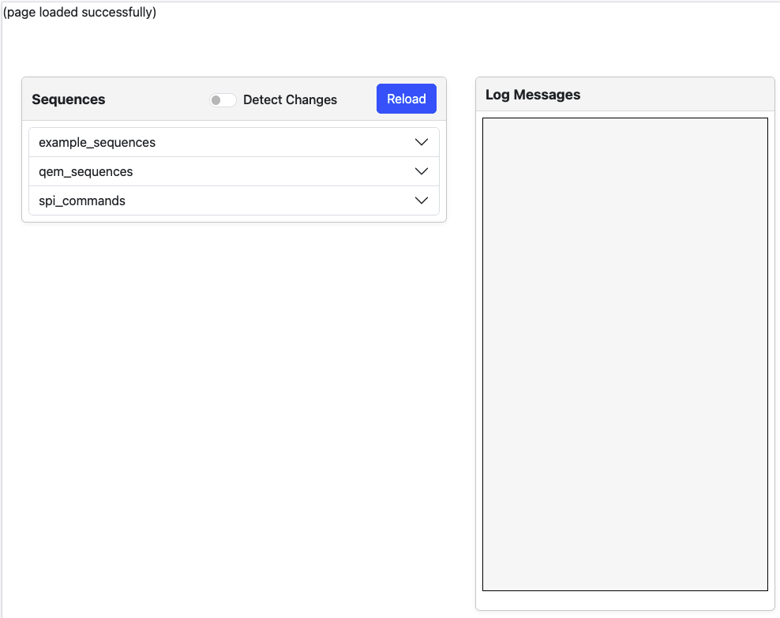
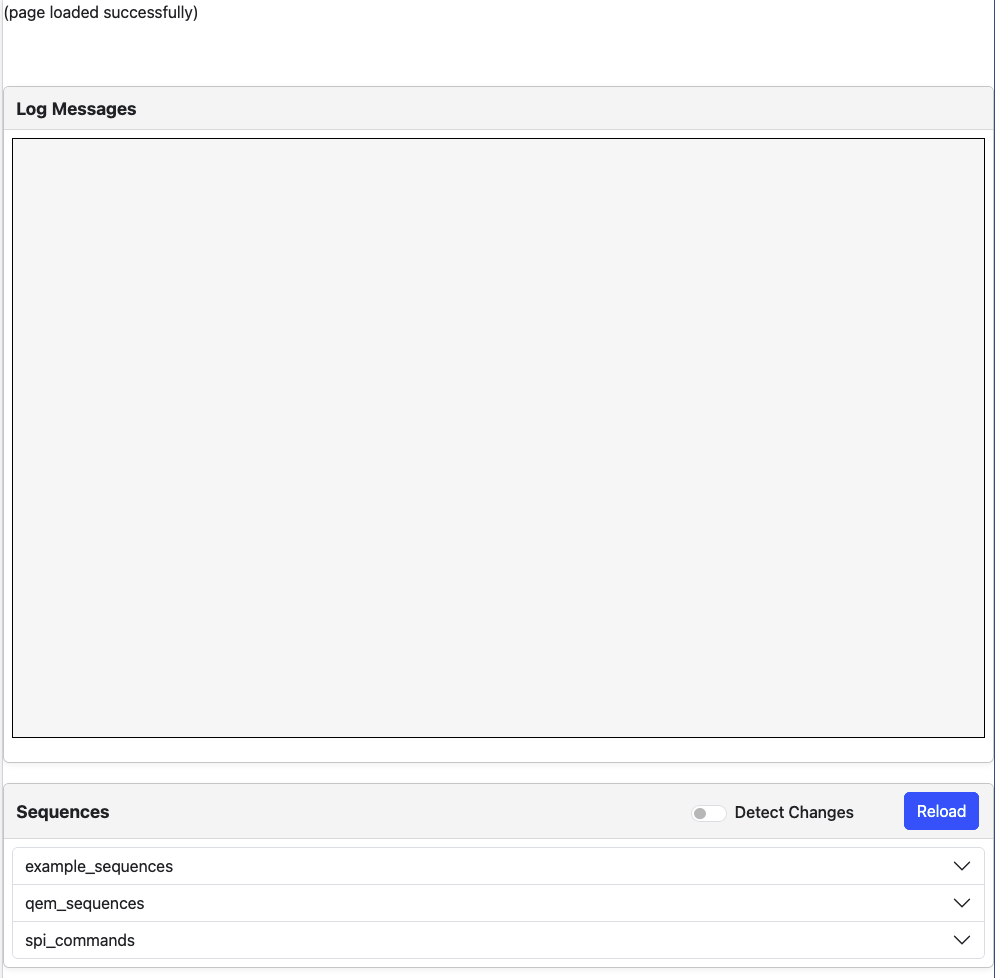
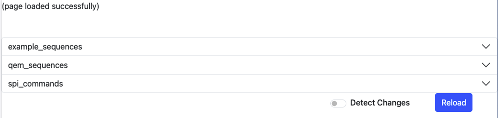

# odin-sequencer-react-ui

React component library for integrating with the [ODIN Sequencer](https://github.com/stfc-aeg/odin-sequencer). Provides a reusable UI dashboard and components for building and controlling sequences.

## Installation

Add to your `package.json` dependencies:

```json
"dependencies": {
  "bootstrap": "^5.3.6",
  "odin-react": "github:stfc-aeg/odin-react",
  "react": "^18.3.1",
  "react-bootstrap": "^2.10.10",
  "react-dom": "^18.3.1",
  "odin-sequencer-react-ui": "github:stfc-aeg/odin-sequencer-ui"
}
```

Then install using `npm install`


## Basic Usage

import components individually

```js
import {
  OdinSequencer,
  OdinSequencerExecutionPanel,
  OdinSequencerMessageLog,
  OdinSequencerModuleList,
  OdinSequencerSequenceButtons,
  OdinSequencerSequenceTable
} from 'odin-sequencer-react-ui';
```

Ensure Bootstrap CSS is available in your app (either top level or where you use the sequencer components)

```js
import 'bootstrap/dist/css/bootstrap.min.css'
```

### Connecting to the sequencer endpoint

When constructing sequencer_endpoint, you will notice `import.meta.env.VITE_SEQUENCER_ENDPOINT_URL`. This is a Vite reference to a .env file that looks something like this:
`VITE_SEQUENCER_ENDPOINT_URL=URL` where URL is the URL of the sequencer endpoint.
If you are not using Vite, you can either replace the import.meta.env with the URL or use .env with `process.env.VITE_SEQUENCER_ENDPOINT_URL`

.env files go in the root of the app you are using this library in. They can have .local at the end and you can add *.local if you do not want to accidentally commit it.


## Examples

### OdinSequencer module example
```js
import { useAdapterEndpoint } from 'odin-react';
import { OdinSequencer } from 'odin-sequencer-react-ui';

function App() {
  const sequencer_endpoint = useAdapterEndpoint("odin_sequencer", import.meta.env.VITE_SEQUENCER_ENDPOINT_URL);
  return (
    <>
      <p>
        (page loaded successfully)
      </p>
      <OdinSequencer sequencer_endpoint={sequencer_endpoint} />
    </>
  )
}

export default App
```


Using this module will import the entire Odin Sequencer UI with all of its functionality. You will not need to include anything other than this.


### Seperate structured example
```js
import { useRef, useEffect, useState } from 'react';
import { useAdapterEndpoint } from 'odin-react';
import { OdinSequencerSequenceTable, OdinSequencerExecutionPanel, OdinSequencerMessageLog } from 'odin-sequencer-react-ui';

function App() {

  const sequencer_endpoint = useAdapterEndpoint("odin_sequencer", import.meta.env.VITE_SEQUENCER_ENDPOINT_URL);

  const [sequenceModules, setSequenceModules] = useState({});
  const executionPanelRef = useRef(null);
  const [abortDisabled, setAbortDisabled] = useState(true);

  const fetchModules = () => {
    return sequencer_endpoint.get('')
      .then(result => {
        setSequenceModules(result.sequence_modules);
      })
      .catch(err => {
        console.error("Error fetching endpoint data:", err);
        setError(err.message);
      });
  };

  useEffect(() => {
    fetchModules();
  }, [])

  return (
    <>
      <p>
        (page loaded successfully)
      </p>
      <div className="alert-box" id="alert-container"></div>
      <OdinSequencerExecutionPanel ref={executionPanelRef} abortDisabled={abortDisabled} setAbortDisabled={setAbortDisabled} sequencer_endpoint={sequencer_endpoint} />
      <OdinSequencerMessageLog />
      <OdinSequencerSequenceTable fetchModules={fetchModules} sequenceModules={sequenceModules} executionPanelRef={executionPanelRef} setAbortDisabled={setAbortDisabled} sequencer_endpoint={sequencer_endpoint} />
    </>
  )
}

export default App
```


Using this example you can import the two cards seperately (the MessageLog and the SequenceTable). However, as discussed below, the ExecutionPanel is required for the SequenceTable to work.


### Unstructured non-cards example
```js
import { useRef, useEffect, useState } from 'react';
import { useAdapterEndpoint } from 'odin-react';
import { OdinSequencerExecutionPanel, OdinSequencerModuleList, OdinSequencerSequenceButtons } from 'odin-sequencer-react-ui';

function App() {

  const sequencer_endpoint = useAdapterEndpoint("odin_sequencer", import.meta.env.VITE_SEQUENCER_ENDPOINT_URL);

  const [sequenceModules, setSequenceModules] = useState({});
  const executionPanelRef = useRef(null);
  const [abortDisabled, setAbortDisabled] = useState(true);

  const fetchModules = () => {
    return sequencer_endpoint.get('')
      .then(result => {
        setSequenceModules(result.sequence_modules);
      })
      .catch(err => {
        console.error("Error fetching endpoint data:", err);
        setError(err.message);
      });
  };

  useEffect(() => {
    fetchModules();
  }, [])

  return (
    <>
      <p>
        (page loaded successfully)
      </p>
      <div className="alert-box" id="alert-container"></div>
      <OdinSequencerExecutionPanel ref={executionPanelRef} abortDisabled={abortDisabled} setAbortDisabled={setAbortDisabled} sequencer_endpoint={sequencer_endpoint} />
      <OdinSequencerModuleList sequence_modules={sequenceModules} executionPanelRef={executionPanelRef} setAbortDisabled={setAbortDisabled} />
      <OdinSequencerSequenceButtons reloadModules={fetchModules} executionPanelRef={executionPanelRef} setAbortDisabled={setAbortDisabled} sequencer_endpoint={sequencer_endpoint} />
    </>
  )
}

export default App

```


You are also able to import the components that make up cards as shown in the above example. However, components related to the SequenceTable may need ExecutionPanel for the executionPanelRef.


## API

### `OdinSequencer`
A fully integrated dashboard that includes all the core components.  
Use this if you want an all-in-one solution.

**Requirements**

However, you are still required to include
```js
  const sequencer_endpoint = useAdapterEndpoint("odin_sequencer", import.meta.env.VITE_SEQUENCER_ENDPOINT_URL);
```

---

### `OdinSequencerMessageLog`
Displays the sequencer's message log inside a React card.  
**No setup or dependencies required.**

---

### `OdinSequencerExecutionPanel`
Contains the execution bar and an abort button. Hidden by default — becomes visible when a sequence is running.  
**Required if using any of the components listed below** that rely on controlling execution state.

**Required state/refs:**

```js
  const executionPanelRef = useRef(null);
  const [abortDisabled, setAbortDisabled] = useState(true);
```

---

### `OdinSequencerModuleList`
Displays available sequence modules in a plain list/table format.

**Required state/refs:**
- Sequencer endpoint
- Fetched sequence modules
- A reference to the execution panel
```js
  const sequencer_endpoint = useAdapterEndpoint("odin_sequencer", import.meta.env.VITE_SEQUENCER_ENDPOINT_URL);
  const [sequenceModules, setSequenceModules] = useState({});
  const executionPanelRef = useRef(null);
  const [abortDisabled, setAbortDisabled] = useState(true);
OdinSequencerExecutionPanel
```

---

### `OdinSequencerSequenceButtons`
Provides "Reload" and "Detect Changes" controls for the sequence modules.
Usually used alongside the module table.

**Requires:**
- Sequencer endpoint
- fetchModules function
- Execution panel reference
```js
  const sequencer_endpoint = useAdapterEndpoint("odin_sequencer", import.meta.env.VITE_SEQUENCER_ENDPOINT_URL);
  fetchModules();
  const executionPanelRef = useRef(null);
  const [abortDisabled, setAbortDisabled] = useState(true);
  OdinSequencerExecutionPanel
```

---

### `OdinSequencerSequenceTalbe`
Combines `OdinSequencerModuleList` and `OdinSequencerSequenceButtons` into a single card UI for interacting with sequences.
Includes both the module display and control buttons.

**Requires:**
- Sequencer endpoint
- Fetched module data
- fetchModules function
- Execution panel reference
```js
  const sequencer_endpoint = useAdapterEndpoint("odin_sequencer", import.meta.env.VITE_SEQUENCER_ENDPOINT_URL);
  fetchModules();
  const [sequenceModules, setSequenceModules] = useState({});
  const executionPanelRef = useRef(null);
  const [abortDisabled, setAbortDisabled] = useState(true);
  OdinSequencerExecutionPanel
```

---

### `sequencer_endpoint`
Provides API access methods for interacting with the backend.
Primarily used by your fetchModules function as well as modules listed.

**Usage:**
```js
import { useAdapterEndpoint } from 'odin-react';

function App() {
  const sequencer_endpoint = useAdapterEndpoint("odin_sequencer", import.meta.env.VITE_SEQUENCER_ENDPOINT_URL);
  sequencer_endpoint.get('').then(...)
}
```

---

> Note:
> To enable alert rendering correctly, ensure the following is present in your HTML/JSX
> (Not needed if using the OdinSequencer module)
> ```jsx
> <div className="alert-box" id="alert-container"></div>
> ```


## Compatibility

- React 18+ — Required. Minor version differences are supported, but major versions other than 18 will fail.
- Bootstrap 5 — Required for correct styling.
- React-Bootstrap — Used for layout and components.
- Build tools:
  - Tested with Vite
  - Should also work with other react build system.