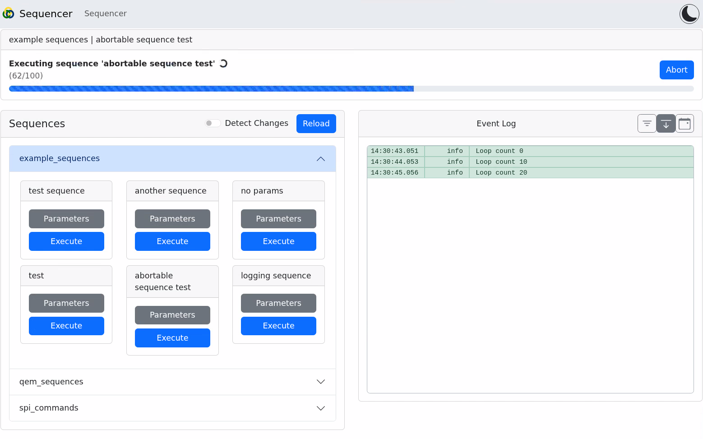

# odin-sequencer-ui

React component library for integrating with the [ODIN Sequencer](https://github.com/stfc-aeg/odin-sequencer). Provides a reusable UI dashboard and components for building and controlling sequences.

## Installation

Add to your `package.json` dependencies:

```json
"dependencies": {
  "bootstrap": "^5.3.6",
  "odin-react": "github:stfc-aeg/odin-react",
  "react": "^18.3.1",
  "react-bootstrap": "^2.10.10",
  "react-dom": "^18.3.1",
  "odin-sequencer-ui": "github:stfc-aeg/odin-sequencer-ui"
}
```
You can refer to a specific version with `#x.x.x` on the end, matching a version tag on the repo here.

Then install using `npm install`.


## Basic Usage

You can import components individually or all at once, as in the examples below.

```js
import {
  OdinSequencer,
  OdinSequencerExecutionPanel,
  OdinSequencerMessageLog,
  OdinSequencerModuleList,
  OdinSequencerSequenceButtons,
  OdinSequencerSequenceTable
} from 'odin-sequencer-ui';
```

Ensure Bootstrap CSS is available in your app (either top level or where you use the sequencer components)

```js
import 'bootstrap/dist/css/bootstrap.min.css'
```

### Connecting to the sequencer endpoint

The sequencer dashboard ('OdinSequencer') creates an endpoint for you, but the other components will require an AdapterEndpoint object directly. You will need to provide the endpoint URL and name. Often, the endpoint will be derived from the `.env.development` file, which should contain text like: `VITE_ENDPOINT_URL="http://w.x.y.z:port"`. Then, that URL will be accessible through environment variables as follows.

The name is provided as a separate argument here as you may call the adapter something different (e.g. 'sequencer') in your odin application.

```js
function App() {

    const endpoint_url = import.meta.env.VITE_ENDPOINT_URL;

    const navLinks = ["Sequencer"]

    return (
      <OdinApp title="Sequencer" navLinks={navLinks}>
        <OdinSequencer endpoint_name={'odin_sequencer'} endpoint_url={endpoint_url} poll_interval={1000}/>
      </OdinApp>
    )
}
```

In non-vite applications, you can use the react environment variable reference `process.env.VITE_SEQUENCER_ENDPOINT_URL` or (not preferred) simply hardcode the URL into the application.
An environment variable goes in the root of the application this library is used in. You may want to add it to your `.gitignore` to avoid committing it.

## Examples

### OdinSequencer module example

The OdinSequencer component implements all the others in a sensible order. If you use this component in this way, you will not need any others, and the component will handle the creation of the adapter endpoint for you.  
This is the expected way to use the application, but if you need a component and don't need any cross-interaction between them, then you can import them separately as seen below.

Note: when used this way, the MessageLog will poll on the same interval as the interval passed as prop here.

```js
import { OdinSequencer } from 'odin-sequencer-ui';

function App() {
  const endpoint_url = import.meta.env.VITE_ENDPOINT_URL;
  return (
    <OdinSequencer endpoint_name={'odin_sequencer'} endpoint_url={endpoint_url} poll_interval={1000}/>
  )
}

export default App
```



## API

### `OdinSequencer`

The full OdinSequencer UI. When imported, place it into your application and use as-is. Ideally, it should have its own page as it is designed around full-width.  

**Props/Requirements**

- `endpoint_name`: name of the odin API point (see the `.cfg` file for your control instance) the dashboard is to connect to, e.g. `odin_sequencer`, `sequencer`, etc.
- `endpoint_url`: endpoint url to connect to, typically of the form `http://w.x.y.z:port`. Typically derived from environment variable
- `poll_interval`: interval that endpoint should be polled in milliseconds, also used for the MessageLog.

```js
import { useAdapterEndpoint } from '@dssg/odin-react';
import { OdinSequencer, type SequencerTypes} from 'odin-sequencer-ui';

function App(
  const endpoint_name = "odin_sequencer"
  const endpoint_url = import.meta.env.VITE_SEQUENCER_ENDPOINT_URL;
  const poll_interval = 1000;
  return (
    <OdinSequencer endpoint_name={endpoint_name} endpoint_url={endpoint_url} poll_interval={1000}>
  )
)
```

---

### `MessageLog`

Displays the sequencer's message log inside using an OdinEventLog component with some special handling of the sequencer's message format.

**Props/Requirements**  
Typically, these are inherited from the OdinSequencer component.
- `endpoint_name`: name of the odin API point (see the `.cfg` file for your control instance) the dashboard is to connect to, e.g. `odin_sequencer`, `sequencer`, etc.
- `endpoint_url`: endpoint url to connect to, typically of the form `http://w.x.y.z:port`. Typically derived from environment variable
- `poll_interval`: interval that endpoint should be polled in milliseconds, also used for the MessageLog.

```js
import { useAdapterEndpoint } from '@dssg/odin-react';
import { MessageLog, type SequencerTypes} from 'odin-sequencer-ui';

function App(
  const endpoint_name = "odin_sequencer"
  const endpoint_url = import.meta.env.VITE_SEQUENCER_ENDPOINT_URL;
  const poll_interval = 1000;
  return (
    <MessageLog endpoint_name={endpoint_name} endpoint_url={endpoint_url} poll_interval={1000}>
  )
)
```

---

### `ExecutionPanel`

Hidden unless a sequence is executing. Displays the progress bar (if set_progress is used by the sequence) and an abort button (for sequences that can be aborted).

Contains the execution bar and an abort button. Hidden by default — becomes visible when a sequence is running.  
**Required if using any of the components listed below** that rely on controlling execution state.

**Props/Requirements**  
- `endpoint`: AdapterEndpoint\<SequencerTypes> connected to a sequencer instance.

```js
import { useAdapterEndpoint } from '@dssg/odin-react';
import { ExecutionPanel, type SequencerTypes} from 'odin-sequencer-ui';

function App(
  const sequencerEndpoint = useAdapterEndpoint<SequencerTypes>('odin_sequencer', import.meta.env.VITE_SEQUENCER_ENDPOINT_URL, 1000);
  return (
    <ExecutionPanel endpoint={sequencerEndpoint}>
  )
)
```

---

### `ModuleList`

Creates an Accordion series of SequenceModule components (Accordion items) for each sequence module file found.

**Props/Requirements**  
- `endpoint`: AdapterEndpoint\<SequencerTypes> connected to a sequencer instance.

```js
import { useAdapterEndpoint } from '@dssg/odin-react';
import { ModuleList, type SequencerTypes} from 'odin-sequencer-ui';

function App(
  const sequencerEndpoint = useAdapterEndpoint<SequencerTypes>('odin_sequencer', import.meta.env.VITE_SEQUENCER_ENDPOINT_URL, 1000);
  return (
    <ModuleList endpoint={sequencerEndpoint}>
  )
)
```

---

### `SequenceButtons`

Provides a 'reload' button and 'detect changes' toggle for the sequence modules. This is usually used alongside the module table, and in the SequenceTable is integrated into the card header above the ModuleList.

**Props/Requirements**  
- `endpoint`: AdapterEndpoint\<SequencerTypes> connected to a sequencer instance.
- `onReload`: Optional function for after the reload button is clicked. This should update some variable such that `ReloadUpdate` has an indication of when to display (immediately and without relying on a poll).

```js
import { useAdapterEndpoint } from '@dssg/odin-react';
import { SequenceButtons, type SequencerTypes} from 'odin-sequencer-ui';

function App(
  const sequencerEndpoint = useAdapterEndpoint<SequencerTypes>('odin_sequencer', import.meta.env.VITE_SEQUENCER_ENDPOINT_URL, 1000);
  const [reloadTrigger, setReloadTrigger] = useState(0);
  return (
    <SequenceButtons endpoint={sequencerEndpoint} onReload={() => setReloadTrigger(prev => prev+1)}>
  )
)
```

---

### `SequenceTable`

Combine `ModuleList` and `SequenceButtons` into a single card UI for interacting with sequences. This displays the 'detect changes'/'reload' buttons and 

**Props/Requirements**  
- `endpoint`: AdapterEndpoint\<SequencerTypes> connected to a sequencer instance.
- `onReload`: Optional function for after the reload button is clicked. This should update some variable such that `ReloadUpdate` has an indication of when to display (immediately and without relying on a poll).

```js
import { useAdapterEndpoint } from '@dssg/odin-react';
import { SequenceButtons, type SequencerTypes} from 'odin-sequencer-ui';

function App(
  const sequencerEndpoint = useAdapterEndpoint<SequencerTypes>('odin_sequencer', import.meta.env.VITE_SEQUENCER_ENDPOINT_URL, 1000);
  const [reloadTrigger, setReloadTrigger] = useState(0);
  return (
    <SequenceButtons endpoint={sequencerEndpoint} onReload={() => setReloadTrigger(prev => prev+1)}>
  )
)
```

---

### `SequenceModule`, `Cardrow`, `SequenceCard`, and `ModalParams`

A `SequenceModule` displays a `Cardrow` as part of an Accordion item from a `ModuleList` as described above.  
A `CardRow` displays a `SequenceCard` for each sequence it identifies in a given sequence module.  
A `SequenceCard` is a small TitleCard that displays the sequence name, has a button to execute the sequence and another 'parameters' button to display the `ModalParams`.  
A `ModalParams` component displays a name, type label and input field for all the parameters associated with a sequence.

**Props/Requirements**

The components use similar props.
- (all) `endpoint`: AdapterEndpoint\<SequencerTypes> connected to a sequencer instance.
- (all) `moduleName`: string representing the name of the sequence module file 
- (SequenceModule and CardRow) `sequences`: SequenceModuleTypes object representing the `sequence: sequenceParams` structure from the parameter tree. This and moduleName are typically pulled from one data point and mapped out e.g. `(endpoint.data?.sequence_modules ?? {}).map(([moduleName, sequences]) => (\<Create components>)`
- (SequenceCard and ModalParams) `sequenceName`: string representing the sequence name. It should be possible to pull this value directly from `sequences` from the usual parent objects, which should be a `{sequenceName: sequenceParams}`-shaped object.
- (SequenceCard and ModalParams) `sequenceConfig`: object representing the param configuration, in the shape `{paramKey: value: val, type: "type", default: defaultValue}`. It should be possible to pull this directly from `sequences` in the usual parent objects and map to create all the components you need. See the code here for examples if you need to reimplement it.

---

### `ModuleModificationsDetected`

A small banner that, when 'Detect Changes' (`SequenceButtons`) is enabled, will display a banner prompting the user to click 'reload'.  
This component therefore works best with the `SequenceButtons` component.

**Props/Requirements**
- `endpoint`: AdapterEndpoint\<SequencerTypes> connected to a sequencer instance.

```js
import { useAdapterEndpoint } from '@dssg/odin-react';
import { ModuleModificationsDetected, type SequencerTypes} from 'odin-sequencer-ui';

function App(
  const sequencerEndpoint = useAdapterEndpoint<SequencerTypes>('odin_sequencer', import.meta.env.VITE_SEQUENCER_ENDPOINT_URL, 1000);
  return (
    <ModuleModificationsDetected endpoint={sequencerEndpoint}>
  )
)
```

---

### `ReloadUpdate`

An alert banner indicating the results of a reload command.  
This component therefore works best with the `SequenceButtons` component. Unlike the `onReload` prop in that component, this one is mandatory for the component to function.

**Props/Requirements**
- `endpoint`: AdapterEndpoint\<SequencerTypes> connected to a sequencer instance.
- `reloadTrigger`: a value that should be updated when a reload command is sent, see `SequenceTable` above.

```js
import { useAdapterEndpoint } from '@dssg/odin-react';
import { ReloadUpdate, type SequencerTypes} from 'odin-sequencer-ui';

function App(
  const sequencerEndpoint = useAdapterEndpoint<SequencerTypes>('odin_sequencer', import.meta.env.VITE_SEQUENCER_ENDPOINT_URL, 1000);
  const [reloadTrigger, setReloadTrigger] = useState(0);

  return (
    <ReloadUpdate endpoint={sequencerEndpoint}, reloadTrigger={reloadTrigger}>
  )
)
```
